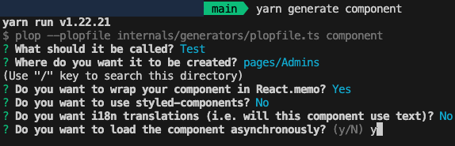

# Instruction

- Clone the repository using ‘git clone <repo-url>’
- Then run
  ```jsx
  yarn install
  yarn start
  ```
- Open http://localhost:3000

### How to create a component?

```jsx
yarn generate component
```



It will ask these question, always choose the option as shown in image.

### How to create a RTK Slice?

```jsx
yarn generate slice
```


It will ask these question, always choose the option as shown in image.

### How to create RTK Query?

- First create a slice using above mentioned command.
- Then in slice/index.ts import rtk query api


- Then create a rtk query api like
  
- Mention the state for rtk query in src/types/RootState.ts file
  
- Then mention the rtk middleware in src/store/rtkQueryMiddleware.ts file.
  
